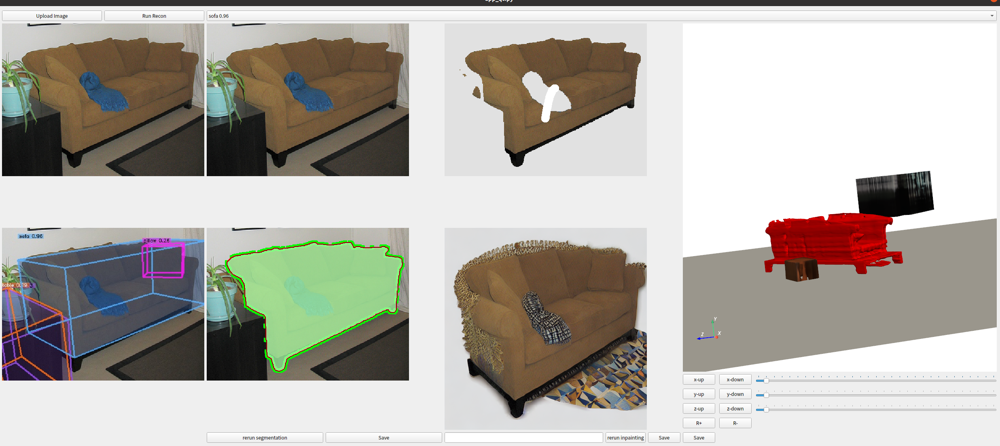

# Recon3D

## Installation

1.create python envs

The code requires `python>=3.8`

```
conda create -n recon3D python=3.9
```

2.install pytorch

```
conda install pytorch==1.13.1 torchvision==0.14.1 torchaudio==0.13.1 pytorch-cuda=11.6 -c pytorch -c nvidia
```

3.install shap-e

```
git clone https://github.com/openai/shap-e.git
cd shap-e
pip install -e .

# install yaml, ipywidgets
pip install pyyaml
pip install ipywidgets

# install pytorch3d (optional, speed up rendering)
conda install pytorch3d -c pytorch3d
```

4.install diffusers

```
conda install -c conda-forge diffusers

# install transformers
pip install transformers
```

5.install SAM

```
git clone https://github.com/facebookresearch/segment-anything.git
cd segment-anything
pip install -e .

# install cv2 ...
pip install opencv-python pycocotools matplotlib onnxruntime onnx
```

6.install omni3d

```
git clone https://github.com/facebookresearch/omni3d.git
python -m pip install 'git+https://github.com/facebookresearch/detectron2.git'

# install pandas
pip install pandas
```


## Download checkpoints

1.SAM

Click the links below to download the checkpoint for the corresponding model type.

- **`default` or `vit_h`: [ViT-H SAM model.](https://dl.fbaipublicfiles.com/segment_anything/sam_vit_h_4b8939.pth)**
- `vit_l`: [ViT-L SAM model.](https://dl.fbaipublicfiles.com/segment_anything/sam_vit_l_0b3195.pth)
- `vit_b`: [ViT-B SAM model.](https://dl.fbaipublicfiles.com/segment_anything/sam_vit_b_01ec64.pth)

2.Shap-e

Put the downloaded files in the `shap_e_model_cache` folder

- [transmitter](https://openaipublic.azureedge.net/main/shap-e/transmitter.pt)
- [decoder](https://openaipublic.azureedge.net/main/shap-e/vector_decoder.pt)
- [image300M](https://openaipublic.azureedge.net/main/shap-e/image_cond.pt)


## Run
```
# push test image in `test_img/real_img`
python demo.py --config-file cubercnn://omni3d/cubercnn_DLA34_FPN.yaml --input-folder "test_img/real_img" --threshold 0.25 --sam_checkpoint segment-anything/checkpoints/sam_vit_h_4b8939.pth --model_type vit_h --shap_e_cache_dir shap-e/shap_e/examples/shap_e_model_cache  MODEL.WEIGHTS cubercnn://omni3d/cubercnn_DLA34_FPN.pth OUTPUT_DIR output/demo
```

### Run QT app
```
python app_qt.py
```

- click upload button, choose a image and upload, then run Run Recon button, the pipeline will auto run.
- wait a minute, the all result will show in the app, including detection, segmentation, inpainting and 3d model part.
- you can choose the object which you want to refine in the top combo layout, like 'sofa 0.96'
- In first column, first row is uploaded image,  second row is detection result.
- In second column, first row is segmentation prompt input layout(todo), click one position and click save, then run, the segmentation will rerun by your prompt. Second row is segmentation result, you can drug and mask points with  mouse left button, add any mask key points with clicking mouse left button, and delete and points with mouse right button in points position. Click save, the changed segmentation will saved.
- In third column, first row is inpaint input mask image, the second row is inpainting result image. In the inpaint input layout, you can paint any area, the click save and rerun inpaint button, the painted area will be inpainting. You can also input the text prompt before rerun inpainting, like 'a brown sofa'.
- In for fourth column, top layout is 3D show layout, the selected object is painted with red color, you can move this object along it's local xyz axis, the rotate along it's z axis( only +- 90°).

